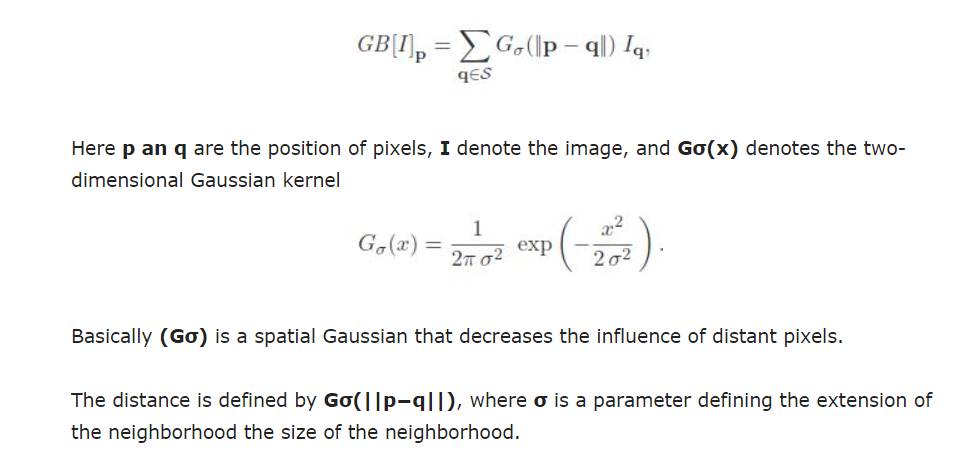
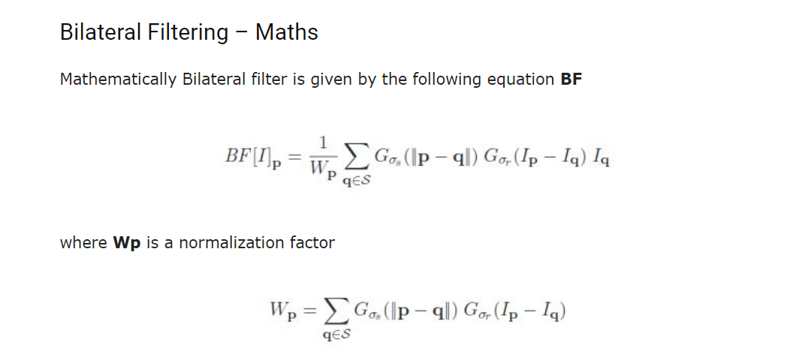
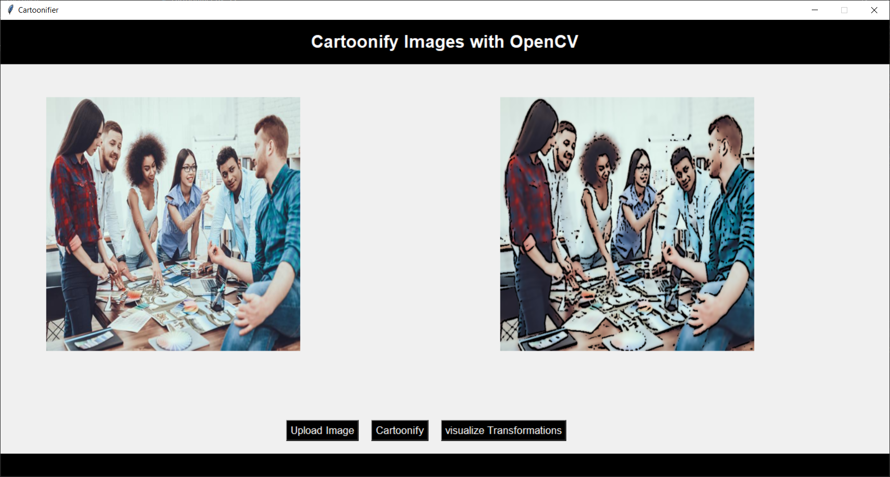
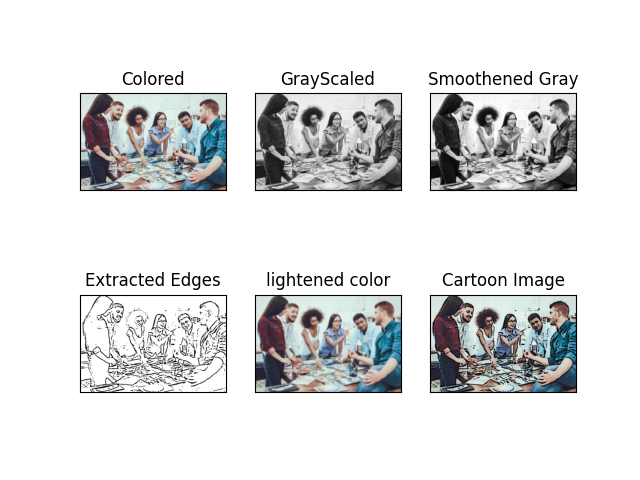
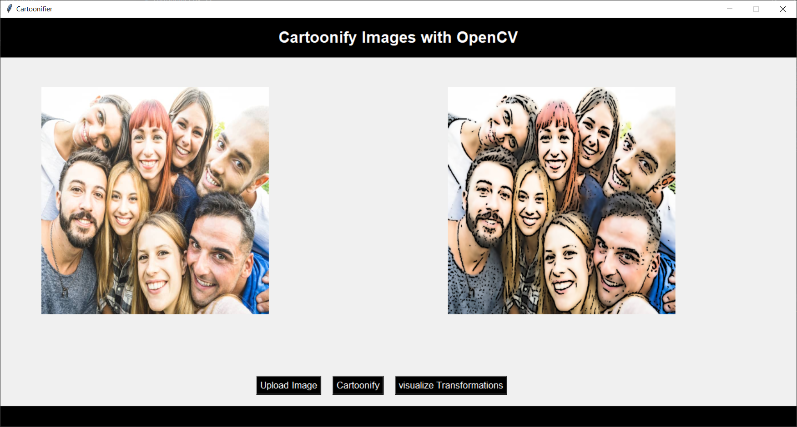
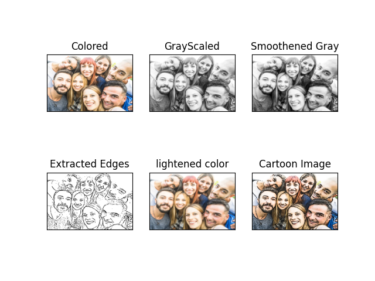

# What is OpenCV:
OpenCV is a cross-platform library used for Computer Vision. It includes applications like video and image capturing and processing. 

It is majorly used in image transformation, object detection, face recognition, and many other stunning applications.

# Cartoonify Images With OpenCV
To convert an image to a cartoon, multiple transformations are done:
1. Firstly, an image is converted to a Grayscale image.
2. Then, the Grayscale image is smoothened 
3. Retrieving the edges of that image.
4. Finally, we form a color image and mask it with edges.
   
This creates a beautiful cartoon image with edges and lightened color of the original image.

## 1. Transforming the image to grayscale:
Our first step is to convert the image into grayscale.

## 2. Smoothening the grayscale image:
### Image Blurring (Image Smoothing):

Image blurring is achieved by convolving the image with a low-pass filter kernel. It is useful for removing noise. 

It actually removes high frequency content (e.g: noise, edges) from the image resulting in edges being blurred when this is filter is applied.

OpenCV provides mainly four types of blurring techniques:
1. **Averaging**
2. **Gaussian Filtering**
3. **Median Filtering**
4. **Bilateral Filtering**

### Median Filtering:
The function cv2.medianBlur() computes the median of all the pixels under the kernel window and the central pixel is replaced with this median value. 

This is highly effective in removing salt-and-pepper noise, it reduces the noise effectively. 

The kernel size must be a positive odd integer.

## 3. Retrieving the edges:
Cartoon effect has two specialties:
1. **Highlighted Edges**
2. **Smooth colors**

In this step, we will work on the first specialty. Here, we will try to retrieve the edges and highlight them. 

 This is attained by the **thresholding technique**.
 
### Simple Thresholding:
For every pixel, the same threshold value is applied. 

If the pixel value is smaller than the threshold, it is set to 0, otherwise it is set to a maximum value. 

The function **cv.threshold** is used to apply the thresholding. 

- The first argument is the source image, which should be a grayscale image. 
- The second argument is the threshold value which is used to classify the pixel values. 
- The third argument is the maximum value which is assigned to pixel values exceeding the threshold.

### Adaptive Thresholding:
In the previous technique, we used one global value as a threshold. 

But this might not be good in all cases, e.g. if an image has different lighting conditions in different areas. In that case, **adaptive thresholding** can help. 

Here, the algorithm determines the threshold for a pixel based on a small region around it. So we get different thresholds for different regions of the same image which gives better results for images with varying illumination.

    cv2.adaptiveThreshold(source, maxVal, adaptiveMethod, thresholdType, blocksize, constant)

- **source**: Input Image array(Single-channel, 8-bit or floating-point)
- **maxVal**: Maximum value that can be assigned to a pixel.
- **adaptiveMethod**: Adaptive method decides how threshold value is calculated.
  - **cv2.ADAPTIVE_THRESH_MEAN_C**: Threshold Value = (Mean of the neighbourhood area values – constant value). In other words, it is the mean of the blockSize×blockSize neighborhood of a point minus constant.
  - **cv2.ADAPTIVE_THRESH_GAUSSIAN_C**: Threshold Value = (Gaussian-weighted sum of the neighbourhood values – constant value). In other words, it is a weighted sum of the blockSize×blockSize neighborhood of a point minus constant.
- **thresholdType**: The type of thresholding to be applied.
  - **cv2.THRESH_BINARY**: If pixel intensity is greater than the set threshold, value set to 255, else set to 0 (black).
  - **cv2.THRESH_BINARY_INV**: Inverted or Opposite case of cv2.THRESH_BINARY.
  - **cv.THRESH_TRUNC**: If pixel intensity value is greater than threshold, it is truncated to the threshold. The pixel values are set to be the same as the threshold. All other values remain the same.
  - **cv.THRESH_TOZERO**: Pixel intensity is set to 0, for all the pixels intensity, less than the threshold value.
  - **cv.THRESH_TOZERO_INV**: Inverted or Opposite case of cv2.THRESH_TOZERO.
- **blockSize**: Size of a pixel neighborhood that is used to calculate a threshold value.
- **constant**: A constant value that is subtracted from the mean or weighted sum of the neighbourhood pixels.

## 4. Preparing a Mask Image:
we finally work on the second specialty. 

We prepare a lightened color image that we mask with edges at the end to produce a cartoon image. 

We use **bilateralFilter** which removes the noise, It can be taken as smoothening of an image to an extent.

Since the **Gaussian filter** is very close to the Bilateral filter, it will be good to quickly cover Gaussian filtering.

### Gaussian Filtering:
Gaussian filtering is a weighted average of the intensity of the adjacent positions with weight decreasing with the spatial distance to the center position.
Mathematically, **Gaussian Blur(GB)** filtered image is given by:

### Bilateral Filtering:
As we have seen above, in Gaussian filter only nearby pixels are considered while filtering, It doesn’t consider whether pixels have almost the same intensity. It doesn’t consider whether a pixel is an edge pixel or not. So it blurs the edges also, which we don’t want to do since it takes away crucial details from the image.

Bilateral filtering also takes **a Gaussian filter in space**, but additionally considers one more **Gaussian filter which is a function of pixel difference**. 

**The Gaussian function of space** makes sure that only nearby pixels are considered for blurring, while **the Gaussian function of intensity difference** makes sure that only those pixels with similar intensities to the central pixel are considered for blurring. So it preserves the edges since pixels at edges will have large intensity variation.

The important point which is considered in Bilateral filtering is that the two pixels are close to each other not only if they occupy nearby spatial locations but also if they have some similarity in the photometric range. 

These properties of **bilateral filtering** overcome the drawback of other techniques like **Averaging Blur**, **Gaussian Blur**, and **Median Blur** since it is able to preserve edges.

1. Now we already know from Gaussian filtering that **Gσs** is a spatial Gaussian that decreases the influence of distant pixels.
2. The second term is added **Gσr** which is a range Gaussian that decreases the influence of pixels **q** with an intensity value different from **Ip**.
3. **σs** are the space parameter and **σr** are the range parameter.
4. **σs** represents the spatial extent of the kernel size of the considered neighborhood and **σr** represents the minimum amplitude of an edge. This means that parameters **σs** and **σr** will measure the amount of filtering for the image **I**.

**Note:** range means quantities related to pixel values i.e intensities while space refers to the pixel location.

    cv2.bilateralFilter ( src, dst, d, sigmaColor,sigmaSpace, borderType = BORDER_DEFAULT )
 
- **src** It is the image whose is to be blurred
- **dst** Destination image of the same size and type as src .
- **d** Diameter of each pixel neighborhood that is used during filtering. If it is non-positive, it is computed from sigmaSpace.
- **sigmaColor** Filter sigma in the color space. A larger value of the parameter means that farther colors within the pixel neighborhood will be mixed together, resulting in larger areas of semi-equal color.
- **sigmaSpace** Filter sigma in the coordinate space. A larger value of the parameter means that farther pixels will influence each other as long as their colors are close enough. When d>0, it specifies the neighborhood size regardless of sigmaSpace. Otherwise, d is proportional to sigmaSpace.
- **borderType** border mode used to extrapolate pixels outside of the image

**Note:** **sigmaColor** and **sigmaSpace** are used to give a sigma effect, i.e make an image look vicious and like water paint, removing the roughness in colors.

## 5. Giving a Cartoon Effect:
Finally, we combine the two specialties. 

This will be done using **MASKING**. We perform **bitwise and** on two images to mask them.

    bitwise_and(source1_array, source2_array, destination_array, mask)
- **source1_array** is the array corresponding to the first input image on which bitwise and operation is to be performed.
- **source2_array** is the array corresponding to the second input image on which bitwise and operation is to be performed,
- **destination_array** is the resulting array by performing bitwise operation on the array corresponding to the first input image and the array corresponding to the second input image.
- **mask** is the mask operation to be performed on the resulting image and it is optional.

# This finally CARTOONIFY our image!

